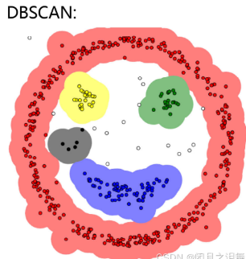

alias::
tags:: 无监督聚类算法, 聚类算法
type:: 概念
status:: 草稿 | 整理中 | 已掌握

	- ## 🧠 一句话说清楚（费曼）
		- 一种文本分类算法，不用告诉它分为多少类（这点刚好与 [[KMeans]]相反 ），它会自己分，会自动过滤掉噪声，可以设置分类最小密度值，低于该值不进行归类。
		- 
	- ## 💘企业开发场景
		- KMeans VS DBSCAN
		  id:: 69aa8904-6d14-4cf4-816e-45ecd8d02582
			- **选 KMeans**：文档数量多（千级以上）、能大致确定主题数量、追求速度和稳定性（RAG 文档聚类主流）；
			- **选 DBSCAN**：文档数量少（千级以内）、完全不知道该分几类、需要过滤噪声文档（仅小众场景）
	- ## ⚠️易错/易混点（复习必看）
		- id:: 69aa8882-8cf8-4dfc-9230-d0bf58e438e4
		  | 场景 / 特性 | KMeans | DBSCAN |
		  | ---- | ---- | ---- |
		  | 聚类数量 | 需手动指定 K | 自动识别数量 |
		  | 速度 | 极快（百万级可用） | 慢（仅适合小数据量） |
		  | 异常值处理 | 无，强行归类 | 有，标记为噪声 |
		  | 簇形状 | 仅支持球形 | 支持任意形状 |
		  | 高维数据 | 效果稳定 | 效果差 |
		  | 企业 RAG 文档聚类 | ✅ 首选（99% 场景） | ❌ 仅小量未知主题文档用 |
	- ## 🔁核心原理/流程（极简版）
	  collapsed:: true
		- {{原理简述}}
	- ##  📘 核心概念（官方）
	  collapsed:: true
		- {{官方说法}}
	- ## 🔍 核心作用（解决什么问题）
	  collapsed:: true
		- {{能解决企业开发当中的什么问题}}
	- ## 🪡关键特点（优缺点）
		- ### 优点
			- 自动识别聚类数量，不用定 K；
			- 能标记噪声 / 异常值；
			- 支持任意形状的簇；
			- 对初始值不敏感。
		- ### 缺点
			- 速度慢，不适合大数据量；
			- 参数调优复杂；
			- 密度不均数据聚类效果差；
			- 高维向量（文档 embedding）效果差。
	- ## 📝 面试题（自问自答）
	  Q:   
	  A:  
	  
	  Q:  
	  A:
	- ## ✅ 掌握程度
		- [ ] 认识
		- [ ] 理解
		- [ ] 能画图
		- [ ] 能背诵
-