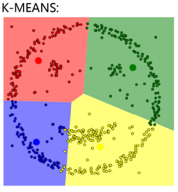

alias::
tags:: 无监督聚类算法, 聚类算法
type:: 概念
status:: 整理中

	- ## 🧠 一句话说清楚（费曼）
		- 一种文本分类算法，你需要提前告诉它分为多少主题（K是多少），否则它就不知道怎么分，这点刚好与[[DBSCAN]]相反，[[DBSCAN]]不用指定K值，
		- 
	- ## 💘企业开发场景
		- {{embed ((69aa8904-6d14-4cf4-816e-45ecd8d02582))}}
	- ## ⚠️易错/易混点（复习必看）
		- {{embed ((69aa8882-8cf8-4dfc-9230-d0bf58e438e4))}}
		  id:: 88011422-c5ff-4e24-af70-20c426d2e59e
	- ## 🔁核心原理/流程（极简版）
		- 随机选 **K 个点作为初始中心**
		- 每个向量找到**离自己最近的中心**，归为一类
		- 重新计算每一类的**新中心**
		- 重复 2–3，直到中心不再变化
		- 输出最终聚类结果
	- ##  📘 核心概念（官方）
		- {{官方说法}}
	- ## 🔍 核心作用（解决什么问题）
	  collapsed:: true
		- {{能解决企业开发当中的什么问题}}
	- ## 🪡关键特点（优缺点）
		- ### 优点
			- 非常快
				- 百万级向量也能秒聚，适合工业级。
			- 适合文档级主题聚类
				- 对**企业文档这种主题差异大**的数据，聚类非常准。
			- 简单稳定
				- 不用调复杂参数
		- ### 缺点
			- 手动指定K
			- 对异常值敏感
				- 脏数据、乱码文档会拉偏中心
			- 只适合球形簇
	- ## 📝 面试题（自问自答）
	  Q:   
	  A:  
	  
	  Q:  
	  A:
	- ## ✅ 掌握程度
		- [ ] 认识
		- [ ] 理解
		- [ ] 能画图
		- [ ] 能背诵
-