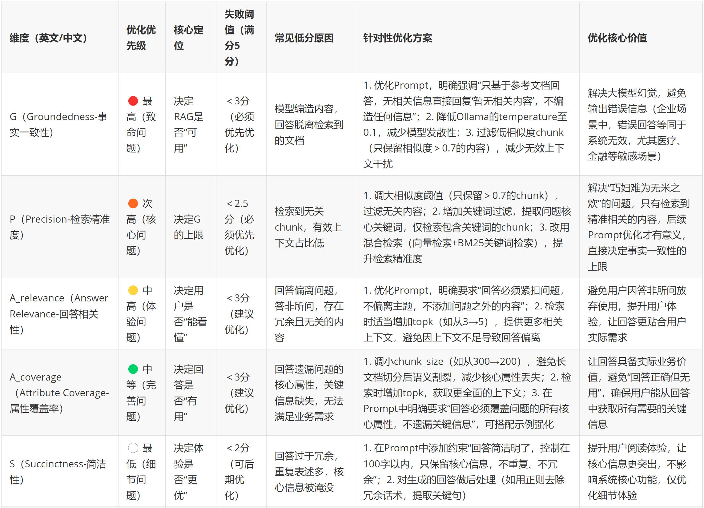

alias::
tags:: RAG评估
type:: 概念
status:: 草稿
id:: 69b0d9f7-7dd9-46b3-bc8b-1cf4c70ab8eb

	- ## 🧠 一句话说清楚（费曼）
		- id:: 69b27383-8d3b-4b2f-ba07-a749438bc59f
		  ```
		  G (Groundedness) - 事实一致性：召回 → 回答
		  P (Precision) - 检索精准度：问题 → 召回
		  A (Answer Relevance) - 回答相关性：问题 → 回答
		  A (Attribute Coverage)  - 全流程相关性：问题 → 召回 → 回答
		  S (Succinctness) - 简洁性：只看回答
		  ```
		- 
		- 核心优化逻辑：先保“能用”（G、P），再提“好用”（A_relevance、A_coverage），最后磨“细节”（S）；每次只优化一个维度，用PAGAS评估验证效果，避免盲目优化。
	- ## 💘企业开发场景
	  collapsed:: true
		- {{实际企业开发当中的场景，按常见度由高往低排序，低于10%的场景不记录}}
		- {{场景一： xxxxxxxx}}
		- {{企业实现：xxxxxxxx}}
	- ## 📝 面试题（自问自答）
	- RAGAS评估中P=0、G/A/S全满分，最可能的原因是什么？#card#面试背诵汇总/大模型/RAG/PAGAS #面试背诵汇总/重点
		- 回答：最可能的原因是向量库数据和评估问题完全无关（数据错配），检索不到相关文档（P=0），但大模型靠自身通用知识生成了表面正确的回答（G/A/S满分），属于伪高分，和检索策略/代码无关。
		- 企业里遇到这种伪高分的RAG系统，第一步该做什么？ #面试背诵汇总/大模型/RAG/PAGAS
			- 处理流程
			  collapsed:: true
				- **先看测试问题是不是在文档里（别拿错了评估案例）**
				- **再看检索召回的内容对不对**
				- **最后才看检索策略、Prompt**
			- 步骤 1：先做 “链路定位”
			  collapsed:: true
				- ```python
				  # 企业通用定位脚本（核心是“分段验证”）
				  def debug_retrieval_chain(query, vector_db, splits):
				      # 环节1：验证文档是否包含问题相关内容（排除“无数据”根因）
				      has_related_content = any(query in doc.page_content for doc in splits)
				      print(f"环节1：文档是否包含问题相关内容？{has_related_content}")
				      
				      # 环节2：验证向量检索的相似度（排除“语义编码/阈值”问题）
				      retrived_docs_with_score = vector_db.similarity_search_with_score(query, k=5)
				      scores = [score for _, score in retrived_docs_with_score]
				      print(f"环节2：检索文档相似度（Top5）：{scores}")
				      print(f"环节2：是否有高相似度文档（≥0.7）？{any(s≥0.7 for s in scores)}")
				      
				      # 环节3：验证检索器是否强制召回（排除“无阈值”问题）
				      retriever = vector_db.as_retriever(search_kwargs={"k":3})
				      retrived_docs = retriever.get_relevant_documents(query)
				      print(f"环节3：检索器是否召回无关文档？{len(retrived_docs) > 0 and not has_related_content}")
				      
				      return {
				          "has_related_content": has_related_content,
				          "high_score_docs": any(s≥0.7 for s in scores),
				          "force_recall_irrelevant": len(retrived_docs) > 0 and not has_related_content
				      }
				  
				  # 执行定位（企业会针对每个低P分问题跑一遍）
				  query = "RAG的核心切分策略有哪些？"
				  debug_result = debug_retrieval_chain(query, vector_db, splits)
				  ```
				- 步骤 2：按根因针对性改造
					- | 根因（企业占比） | 企业解决策略（使用率） | 具体操作（落地代码） |
					  | ---- | ---- | ---- |
					  | 文档无相关内容（60%） | 补充 / 清洗文档（100%） | 1. 往向量库添加问题相关文档；2. 去重 / 格式化文档（比如 PDF 转文本） |
					  | 无相似度阈值（15%） | 设置阈值（95%） | retriever = vector_db.as_retriever(search_kwargs={"k":3, "score_threshold":0.7}) |
					  | 向量 / 切分问题（25%） | 混合检索（90%） | 用 BM25 + 向量的 EnsembleRetriever，适配关键词 / 语义检索 |
					  | （兜底）检索仍失效 | 降级为 “仅关键词检索”（80%） | 暂时关闭向量检索，先用 BM25 保证 P 分，后续优化向量模型 |
				- 步骤 3：Prompt 仅做 “兜底约束”
					- ```python
					  # 企业生产级Prompt（核心是“无相关文档就拒答”）
					  enterprise_prompt = """
					  ### 约束规则（企业内部规范，必须严格遵守）
					  1. 仅使用【文档内容】回答问题，禁止调用自身知识库；
					  2. 若【文档内容】为空或与问题无关，直接返回：“未检索到相关信息，无法回答”；
					  3. 禁止编造、扩展、推测任何内容，回答长度≤100字。
					  
					  【文档内容】：{context}
					  【问题】：{question}
					  【回答】：
					  """
					  ```
		- 为什么企业不能接受“P=0、其他指标满分”的RAG系统？#面试背诵汇总/大模型/RAG/PAGAS
			- 回答：因为企业落地RAG的核心诉求是“利用私有文档回答问题”，而非依赖大模型通用知识；P=0说明系统无法检索到私有文档，无法解决“大模型不知道企业私有信息”的核心痛点。