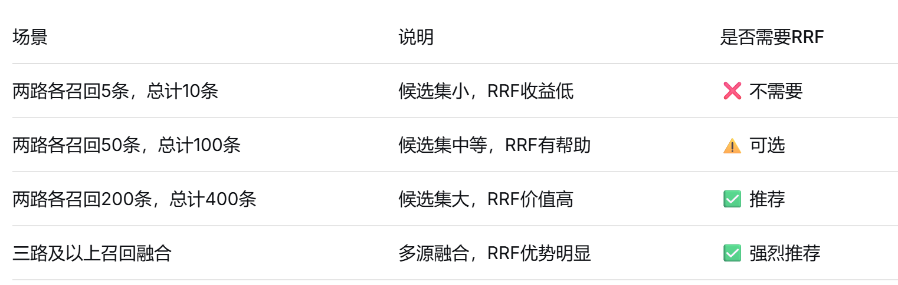

alias:: Reciprocal Rank Fusion, 倒数排名融合
tags:: 混合检索
type:: 概念
status:: 草稿
id:: 69be0d00-9b18-4df9-a7b8-c5f1cf36bb8f

- RRF的作用：把**多路召回**的结果融合起来，不让任何一路的好结果被漏掉，且**数据集数量比较大**时才能突出它的价值。
- RRF的使用场景：  
- RRF本身不是一个模型，而是一种**算法**，用于合并多路召回的结果。正因为如此所以RRF计算速度极快。
-
-
-
-
- 核心逻辑：排名越靠前，倒数分值越高。
	- 计算公式：
	  
	  $$Score_{RRF} = \sum_{r \in R} \frac{1}{k + r}$$
		- $r$ 是文档在某路检索中的**名次**（第一名 $r=1$，第二名 $r=2$...）。
		- $k$ 是一个常数（通常设为 $60$），用来平滑曲线，防止第一名和第二名分差过大。
	- 举个例子：假设有一个文档 A：
		- 在**关键词检索**里排 **第 1 名**。
		- 在**向量检索**里排 **第 3 名**。
		  
		  它的 RRF 得分就是：$\frac{1}{60+1} + \frac{1}{60+3} \approx 0.01639 + 0.01587 = 0.03226$。