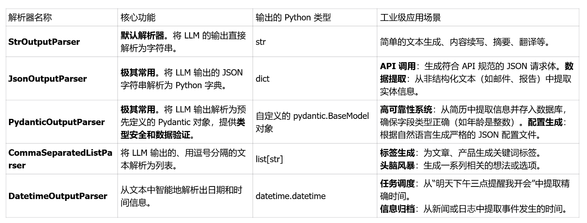
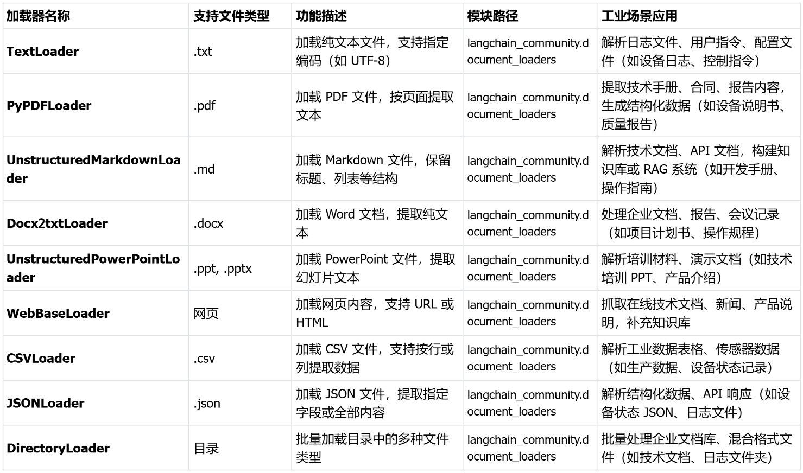

- alias::
  tags::
  type:: 概念
  status:: 草稿
  id:: 69ca68c5-6089-49c1-80e7-a0ecc0e1c51f
- 功能介绍
	- **LangChain AI**
	  collapsed:: true
		- |项目名称|技术栈|核心用途|GitHub 地址|
		  |--|--|--|--|
		  |LangChain|Python/TS|构建 LLM 应用基础组件（链式编排、RAG、嵌入、文档处理等）|https://github.com/langchain-ai/langchain|
		  |langchainjs|JS/TS|前端/Node 环境中构造 LLM 应用|https://github.com/langchain-ai/langchainjs|
		  |langgraph|Python|用图编排复杂 Agent 流程|[https://github.com/langchain-ai/langgraph](https://github.com/langchain-ai/langgraph)|
		  |local-deep-researcher|Python|自动化、多轮本地 Web 研究工具|https://github.com/langchain-ai/local-deep-researcher|
	- LangChain 核心功能
	  collapsed:: true
		- **LLM 和提示（Prompt）**：LangChain 对所有 LLM 大模型进行了 API 抽象，统一了大模型访问 API，同时提供了 Prompt 提示模板管理机制。
		- **输出解析器 (Output Parsers)**：Langchain 接受大模型 (llm) 返回的文本内容之后，可以使用专门的输出解析器对文本内容进行格式化，例如解析 json、或者将 llm 输出的内容转成 python 对象。
		- **链 (Chain)**：Langchain 对一些常见的场景封装了一些现成的模块，例如：基于上下文信息的问答系统，自然语言生成 SQL 查询等等，因为实现这些任务的过程就像工作流一样，一步一步的执行，所以叫链 (chain)。
		- **LCEL**：LangChain Expression Language (LCEL)， langchain 新版本的核心特性，用于解决工作流编排问题，通过 LCEL 表达式，我们可以灵活的自定义 AI 任务处理流程，也就是灵活自定义*链 (Chain)*。
		- **数据增强生成 (RAG)**：因为大模型 (LLM) 不了解新的信息，无法回答新的问题，所以我们可以将新的信息导入到 LLM，用于增强 LLM 生成内容的质量，这种模式叫做 RAG 模式(Retrieval Augmented Generation)。
		- **Agents**：是一种基于大模型（LLM）的应用设计模式，利用 LLM 的自然语言理解和推理能力（LLM 作为大脑)），根据用户的需求自动调用外部系统、设备共同去完成任务，例如：用户输入 “明天请假一天”， 大模型（LLM）自动调用请假系统，发起一个请假申请。
		- **模型记忆（memory）**：让大模型 (llm) 记住之前的对话内容，这种能力称为模型记忆（memory）。
	- 安装命令
	  collapsed:: true
		- ```bash
		  #langchain框架安装
		  pip install langchain
		  #langchain版本查看
		  pip show langchain
		  ```
		- 其它包，参考 [[conda环境配置]]
- LLMs
	- OpenAI调用大模型：没有内置的对话上下文管理
	  collapsed:: true
		- ```python
		  from openai import OpenAI
		  
		  # 初始化DeepSeek的API客户端
		  client = OpenAI(api_key=conf.API_KEY, base_url="https://api.deepseek.com")
		  
		  # 调用DeepSeek的API，生成回答
		  response = client.chat.completions.create(
		      model="deepseek-chat",
		      messages=[
		          {"role": "system", "content": "你是传智教育的助手传智小智，请根据用户的问题给出回答"},
		          {"role": "user", "content": "你好，请你介绍一下你自己。"},],)
		  
		  # 打印模型最终的响应结果
		  print(response.choices[0].message.content)
		  ```
	- 使用`langchain` 调用大模型：内置上下文管理
	  collapsed:: true
		- ```python
		  from langchain_openai import ChatOpenAI
		  from langchain.schema import HumanMessage, SystemMessage
		  
		  # 初始化 ChatOpenAI，配置 DeepSeek API
		  llm = ChatOpenAI(
		      model=conf.MODEL,
		      api_key=conf.API_KEY,
		      base_url=conf.API_URL,
		      temperature=0.7,
		      max_tokens=150)
		  
		  messages = [
		      SystemMessage(content="你是传智教育的助手传智小智2号，请根据用户的问题给出回答"),
		      HumanMessage(content="你好，请你介绍一下你自己。")
		  ]
		  
		  result = llm.invoke(messages)
		  print(result.content)
		  ```
	- invoke方法介绍
	  collapsed:: true
		- 字符串
		  collapsed:: true
			- ```python
			  messages = '中国的首都是哪里？'
			  result = llm.invoke(messages)
			  ```
		- 消息对象列表
		  collapsed:: true
			- ```python
			  messages = [
			      SystemMessage(content="你是传智教育的助手传智小智2号，请根据用户的问题给出回答"),
			      HumanMessage(content="你好，请你介绍一下你自己。")
			  ]
			  result = llm.invoke(messages)
			  ```
		- 字典列表
		  collapsed:: true
			- ```python
			  messages = [
			      {
			          "role": "system",
			          "content": "你是一位地理专家"
			      },
			      {
			          "role": "user",
			          "content": "中国的首都是哪里？"
			      }
			  ]
			  
			  result = llm.invoke(messages)
			  ```
- Prompt
	- ChatPromptTemplate如何使用
	  collapsed:: true
		- 作用：**提示的逻辑（固定结构）与提示的数据（动态变量）彻底分离，从而实现代码的简洁、复用、安全和可维护性**
		- ```python
		  from langchain_core.prompts import ChatPromptTemplate
		  
		  # 1. 创建模板（{topic} 是变量）
		  prompt = ChatPromptTemplate.from_messages([
		      ("system", "你是一个专业的AI助手，请用简洁的语言回答问题"),
		      ("user", "请介绍一下{topic}")
		  ])
		  
		  # 2. 使用 .invoke() 传入变量，生成最终消息
		  # 关键：invoke 接收一个字典，key=模板里的变量名
		  formatted_messages = prompt.invoke({"topic": "稀疏向量"})
		  
		  # 3. 输出结果
		  response = llm.invoke(formatted_messages)
		  
		  # 4. 转成可直接传给大模型的格式（messages）
		  print("\n消息内容：")
		  print(response.content)
		  ```
		- `.invoke()` 接收一个字典，如：`prompt.invoke({"变量名": 值})`
- Message的使用
	- `SystemMessagePromptTemplate`,`HumanMessagePromptTemplate`,`AIMessagePromptTemplate`的使用
	  collapsed:: true
		- ```python
		  from langchain_openai import ChatOpenAI
		  
		  from config import config
		  
		  conf = config()
		  
		  llm = ChatOpenAI(
		      model=conf.MODEL,
		      api_key=conf.API_KEY,
		      base_url=conf.API_URL,
		      temperature=0.7,
		      max_tokens=150
		  )
		  
		  from langchain_core.prompts import (
		      SystemMessagePromptTemplate,
		      HumanMessagePromptTemplate,
		      AIMessagePromptTemplate,
		      ChatPromptTemplate
		  )
		  
		  # 1. 分别定义每一类消息模板
		  system_prompt = SystemMessagePromptTemplate.from_template(
		      "你是一个温柔的AI助手，回答要简短友好"
		  )
		  
		  human_prompt = HumanMessagePromptTemplate.from_template(
		      "帮我解释一下{word}"
		  )
		  
		  ai_prompt = AIMessagePromptTemplate.from_template(
		      "好的，{word}的意思是："
		  )
		  
		  # 2. 组合成完整对话模板
		  chat_prompt = ChatPromptTemplate.from_messages([
		      system_prompt,
		      human_prompt,
		      ai_prompt
		  ])
		  
		  # 3. 使用 invoke 填充变量
		  formatted_messages = chat_prompt.invoke({
		      "word": "稀疏向量"
		  })
		  
		  # 4. 查看最终生成的消息
		  for msg in formatted_messages.to_messages():
		      print(f"[{msg.type}]\n{msg.content}\n")
		  
		  
		  response = llm.invoke(formatted_messages)
		  print("\n消息内容：")
		  print(response.content)
		  ```
- Chain
	- 串行链
	  collapsed:: true
		- ```python
		  from langchain_core.prompts import ChatPromptTemplate
		  from langchain_core.output_parsers import StrOutputParser
		  
		  print("--- 1. 串行链 (Sequential Chain) 示例 ---")
		  
		  # 定义流水线的三个“工位”
		  prompt = ChatPromptTemplate.from_template("写一句关于“{topic}”的七言绝句。")
		  # llm 在通用环境中已定义
		  parser = StrOutputParser()
		  # 使用 LCEL `|` 管道符，将三个工位连接成一条串行流水线
		  serial_chain = prompt | llm | parser
		  
		  # 启动流水线，投入原材料
		  input_data = {"topic": "月色"}
		  result = serial_chain.invoke(input_data)
		  
		  print(f"【输入】: {input_data}")
		  print(f"【最终输出】: {result}")
		  ```
	- 并行链
	  collapsed:: true
		- ```python
		  from langchain_core.prompts import ChatPromptTemplate
		  from langchain_core.output_parsers import StrOutputParser
		  import json
		  from langchain_core.runnables import RunnableParallel
		  print("\n--- 2. 并行链 (Parallel Chain) 示例 ---")
		  
		  # 定义两条独立的子流水线
		  poem_chain = ChatPromptTemplate.from_template("写一首关于“{topic}”的诗。") | llm | StrOutputParser()
		  joke_chain = ChatPromptTemplate.from_template("讲一个关于“{topic}”的俏皮话。") | llm | StrOutputParser()
		  
		  # 使用 RunnableParallel 将字典结构转换为一个可执行的并行链
		  parallel_chain = RunnableParallel({
		      "poem": poem_chain,
		      "joke": joke_chain
		  })
		  
		  # 启动并行流水线
		  input_data = {"topic": "程序员"}
		  # Now .invoke() works because parallel_chain is a Runnable object, not a dict
		  result = parallel_chain.invoke(input_data)
		  
		  print(f"【输入】: {input_data}")
		  print("【最终输出】:")
		  # 结果是一个字典，包含了所有子流水线的输出
		  print(json.dumps(result, indent=2, ensure_ascii=False))
		  ```
		- 输出
		- ```python
		  {
		    "poem": "## 《编码者》\n\n白炽灯管蚕食着子夜，\n咖啡在瓷杯里第三次续沸。\n你端坐于光的断层，\n像守林人凝视发光的年轮。\n\n指尖有群鸟振翅，\n黑键起伏，驯养温顺的闪电。\n当括号咬合，世界便收拢成\n一座精密的玻璃宫殿。\n\n但总在语法间隙，\n你听见字节在暗处发芽——\n它们长出蕨类植物的卷须，\n悄悄爬上防火墙的篱笆。\n\n于是你俯身，将星辰的碎屑\n撒进循环结构的沟渠。\n直到晨曦把注释染成淡青色，\n像初春的雾气漫过窗棂。\n\n而所有未完成的梦境",
		    "joke": "程序员去餐厅点餐：“给我来份炒饭，但不要放盐。”\n厨师：“不放盐怎么吃？”\n程序员：“没事，我回家后可以自己用‘盐值’（注释）调味。”\n\n（注：中文里“盐值”与代码中的“注释”（comment）谐音，程序员常通过注释调整代码逻辑，此处调侃程序员把生活问题当成编程问题解决。）"
		  }
		  ```
	- 分支与 `RunnablePassthrough`
	  collapsed:: true
		- ```python
		  from langchain_core.prompts import ChatPromptTemplate
		  from langchain_core.output_parsers import StrOutputParser
		  import json
		  from langchain_core.runnables import RunnableParallel, RunnablePassthrough
		  
		  print("\n--- 3. 分支与 RunnablePassthrough 示例 ---")
		  
		  
		  # 1. 模拟一个检索器
		  def fake_retriever(query: str) -> str:
		      """一个模拟的检索器，根据查询返回固定的上下文。"""
		      return f"关于“{query}”的背景知识是：这是一个非常重要的概念。"
		  
		  
		  # 2. 定义需要同时接收 context 和 question 的 Prompt
		  rag_prompt = ChatPromptTemplate.from_template(
		      "根据以下上下文回答问题。\n上下文: {context}\n问题: {question}"
		  )
		  
		  # 3. 构建包含 Passthrough 的并行链
		  # 这条链接收一个字符串（问题）作为输入
		  # rag_prompt
		  chain = {
		              # "context" 分支：对输入运行检索器
		              "context": fake_retriever,
		              # "question" 分支：直接“透传”原始输入
		              "question": RunnablePassthrough()
		          } | rag_prompt | llm | StrOutputParser()
		  
		  # 4. 执行链
		  user_question = "LCEL"
		  result = chain.invoke(user_question)
		  
		  print(f"【输入】: '{user_question}'")
		  print(f"【最终输出】:\n{result}")
		  ```
		- 输出
		- ```python
		  ```
	- `RunnableLambda`   自定义
	  collapsed:: true
		- ```python
		  from langchain_core.prompts import ChatPromptTemplate
		  from langchain_core.output_parsers import StrOutputParser
		  from langchain_core.runnables import RunnableLambda
		  
		  print("\n--- 4. RunnableLambda 示例 ---")
		  
		  # 1. 定义一个普通的 Python 函数，它不是标准的 LangChain 组件
		  def add_comment(text: str) -> str:
		      """在一个句子的末尾加上一句俏皮的评论。"""
		      return text.strip() + "\n 关于更多课程，欢迎咨询：https://www.itcast.cn/"
		  
		  # 2. 使用 RunnableLambda 将其包装成一个“标准工位”
		  custom_processor = RunnableLambda(add_comment)
		  
		  # 3. 构建一条包含自定义工位的串行链
		  chain = (
		      ChatPromptTemplate.from_template("请解释一下“{concept}”是什么。")
		      | llm
		      | StrOutputParser()
		      | custom_processor # 在这里接入我们的自定义函数
		  )
		  
		  # 4. 执行链
		  result = chain.invoke({"concept": "大模型"})
		  
		  print("【最终输出】:")
		  print(result)
		  ```
		- 输出
		- ```python
		  --- 4. RunnableLambda 示例 ---
		  【最终输出】:
		  “大模型”通常指**大规模预训练语言模型**，是人工智能领域近年来最重要的技术突破之一。简单来说，它是一种基于深度学习的、拥有**海量参数**（通常达数十亿甚至万亿级别）的神经网络模型，通过在大规模文本数据上进行预训练，获得强大的语言理解和生成能力。
		  
		  ---
		  
		  ### **核心特征**
		  1. **参数规模巨大**  
		     参数量可达千亿级别（例如GPT-3有1750亿参数），模型容量极大，能捕捉极其复杂的语言规律。
		  
		  2. **预训练+微调范式**  
		     - **预训练**：在无标注的海量文本（如网页、书籍）上通过自监督学习（如预测下一个词
		   关于更多课程，欢迎咨询：https://www.itcast.cn/
		  ```
- Output Parsers
	- 解析器类型
	  collapsed:: true
		- 
	- `JsonOutputParser`的使用
	  collapsed:: true
		- ```python
		  from langchain_core.prompts import ChatPromptTemplate
		  from langchain_core.output_parsers import JsonOutputParser
		  
		  print("--- 1. JsonOutputParser 示例 ---")
		  
		  # 1. 创建一个 JsonOutputParser 实例
		  json_parser = JsonOutputParser()
		  
		  # 2. 创建一个 Prompt 模板，并注入格式化指令
		  #    .get_format_instructions() 会自动生成告诉 LLM 如何输出 JSON 的指令
		  prompt = ChatPromptTemplate.from_template(
		      """从以下文本中提取用户的姓名和城市。
		  
		  {format_instructions}
		  
		  文本: {text}"""
		  )
		  
		  # 3. 构建 LCEL 链
		  chain = prompt | llm | json_parser
		  
		  # 4. 准备输入数据
		  unstructured_text = "张伟是一位居住在北京的软件工程师，他今年30岁。"
		  
		  # 5. 调用链并传入格式化指令和文本
		  result = chain.invoke({
		      "format_instructions": json_parser.get_format_instructions(),
		      "text": unstructured_text
		  })
		  
		  # 6. 验证输出
		  print(f"【输入文本】: {unstructured_text}")
		  print(f"【输出类型】: {type(result)}")
		  print(f"【解析结果】: {result}")
		  ```
		- 输出
		- ```python
		  {'name': '张伟', 'city': '北京'}
		  ```
	- `PydanticOutputParser`的使用
	  collapsed:: true
		- ```python
		  from langchain_core.output_parsers import PydanticOutputParser
		  from langchain_core.prompts import ChatPromptTemplate
		  from langchain_openai import ChatOpenAI
		  from pydantic import BaseModel, Field
		  
		  from config import config
		  
		  conf = config()
		  
		  llm = ChatOpenAI(
		      model=conf.MODEL,
		      api_key=conf.API_KEY,
		      base_url=conf.API_URL,
		      temperature=0.7,
		      max_tokens=150
		  )
		  # ----------------------------------------------------
		  #     使用 PydanticOutputParser 进行类型安全的解析
		  # ----------------------------------------------------
		  print("--- 2. PydanticOutputParser 示例 ---")
		  
		  # 步骤 1: 使用 Pydantic V2 的 BaseModel 定义你期望的数据结构
		  class UserInfo(BaseModel):
		      name: str = Field(description="用户的姓名")
		      city: str = Field(description="用户居住的城市")
		      age: int = Field(description="用户的年龄")
		  
		  # 步骤 2: 从 Pydantic 模型创建解析器
		  pydantic_parser = PydanticOutputParser(pydantic_object=UserInfo)
		  
		  # 步骤 3: 创建 Prompt 模板，并准备注入格式化指令
		  prompt = ChatPromptTemplate.from_template(
		      """从用户的文本中提取所需信息。
		  
		  {format_instructions}
		  
		  用户文本: {text}
		  """
		  )
		  
		  # 步骤 4: 构建 LCEL 链
		  chain = prompt | llm | pydantic_parser
		  
		  # 步骤 5: 准备输入文本
		  unstructured_text = "张伟是一位居住在北京的软件工程师，他今年30岁。"
		  
		  # 步骤 6: 调用链，并传入文本和由 Pydantic 解析器生成的、更丰富的指令
		  result_object = chain.invoke({
		      "text": unstructured_text,
		      "format_instructions": pydantic_parser.get_format_instructions()
		  })
		  
		  # ----------------------------------------------------
		  #               结果分析与验证
		  # ----------------------------------------------------
		  print(f"\n【输入文本】: {unstructured_text}")
		  print(f"【输出类型】: {type(result_object)}")
		  print(f"【解析出的对象】: {result_object}")
		  
		  print("\n--- 验证对象的属性和类型 ---")
		  # 可以像操作一个普通的 Python 对象一样访问其属性
		  print(f"姓名 (name): {result_object.name}")
		  print(f"城市 (city): {result_object.city}")
		  # 关键验证：age 字段的类型
		  print(f"年龄 (age): {result_object.age}")
		  print(f"年龄的数据类型: {type(result_object.age)}")
		  
		  """
		  __main__.UserInfo ：在当前运行的脚本中定义（而不是从外部库导入）的那个 UserInfo 类。
		  """
		  
		  ```
- Document Loaders
	- 常见文档加载器`Langchain_community.document_loaders`
	  collapsed:: true
		- 
	- `TextLoader`
	  collapsed:: true
		- ```python
		  from langchain_community.document_loaders import TextLoader  # 使用新模块路径
		  from config import config
		  from langchain_openai import ChatOpenAI
		  from datetime import datetime
		  
		  # 初始化配置和模型
		  conf = config()
		  llm = ChatOpenAI(
		      model=conf.MODEL,  # 直接指定模型名称
		      api_key=conf.API_KEY,
		      base_url=conf.API_URL,
		      temperature=0.7,
		      max_tokens=150
		  )
		  
		  # Document Loaders 示例：加载文档并接入大模型总结
		  loader = TextLoader(r"./林青霞.txt", encoding="utf-8")
		  
		  documents = loader.load()
		  doc=documents[0]
		  
		  print("\n--- 1. 加载后的原始元信息 ---")
		  print(doc.metadata)
		  
		  # 1.2 像操作字典一样，为 Document 对象添加自定义元信息
		  print("\n--- 2. 添加自定义元信息 ---")
		  doc.metadata['author'] = 'DT.L'
		  doc.metadata['version'] = '1.1'
		  doc.metadata['processed_at'] = datetime.now().isoformat()
		  doc.metadata['tags'] = ['test', 'loader', 'metadata']
		  
		  print("更新后的元信息:")
		  print(doc.metadata)
		  
		  print("\n--- 3. 访问特定的元信息 ---")
		  print(f"Author: {doc.metadata.get('author', 'Unknown')}")
		  print(f"Tags: {doc.metadata.get('tags')}")
		  
		  print("\n--- 4. 删除元信息 ---")
		  del doc.metadata['version']
		  
		  print("更新后的元信息:")
		  print(doc.metadata)
		  print("\n--- 5. 获取文本信息 ---")
		  print(doc.page_content)
		  # --- 6. 清空文本信息 -不能采用del ---
		  print("\n--- 6. 清空文本信息 ---")
		  doc.page_content = "" # 正确做法：赋值为空字符串，而不是删除属性
		  print("更新后的信息:")
		  print(doc)
		  ```
	- `PyPDFLoader`
		- ```python
		  from langchain_community.document_loaders import TextLoader,PyPDFLoader  # 使用新模块路径
		  from config import config
		  from langchain_openai import ChatOpenAI
		  
		  # 初始化配置和模型
		  conf = config()
		  llm = ChatOpenAI(
		      model=conf.MODEL,  # 直接指定模型名称
		      api_key=conf.API_KEY,
		      base_url=conf.API_URL,
		      temperature=0.7,
		      max_tokens=150
		  )
		  # Document Loaders 示例：加载文档并接入大模型总结
		  loader = PyPDFLoader(r"D:\LLM_Codes\Chapter3_RAG\rag_base_frame\data\test_resume.pdf")
		  documents = loader.load()
		  content = documents[0].page_content
		  print("原始简历内容：",content)
		  
		  # 使用 LLM 总结
		  result = llm.invoke(f"总结以下内容：{content[:500]}")  # 取前500字符
		  print("Document Loaders 示例结果:", result.content)
		  ```