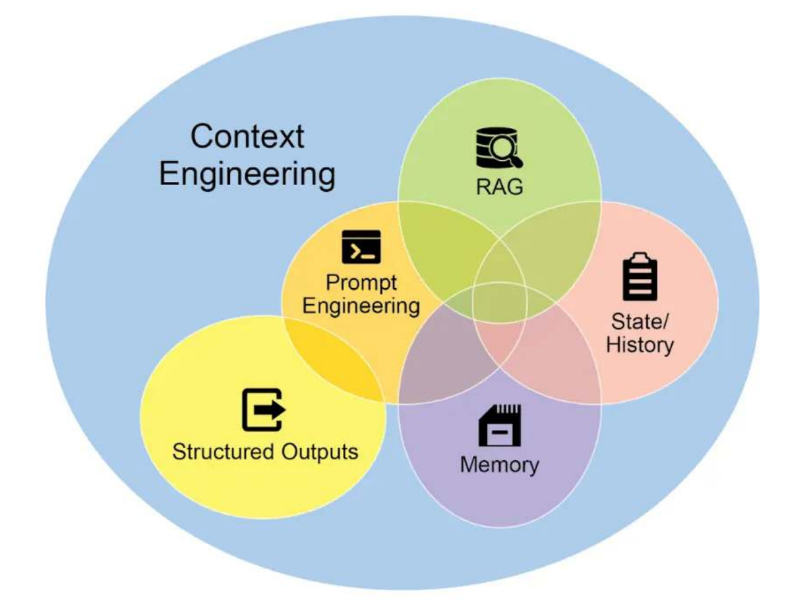

alias:: Context Engineering
tags::
type:: 概念
status:: 草稿

	- ## 🧠 一句话说清楚（费曼）
		- 上下文工程包含如下内容：
			- [[提示词工程]]
			- [[RAG]]
			- Structured Outputs（结构化输出）
			- State History（状态管理）
			- Memory（记忆）
		- 
	- ## 💘企业开发场景
	  collapsed:: true
		- {{实际企业开发当中的场景，按常见度由高往低排序，低于10%的场景不记录}}
		- {{场景一： xxxxxxxx}}
		- {{企业实现：xxxxxxxx}}
	- ## 📝 面试题（自问自答）
	  collapsed:: true
		- {{问题一：XXX }}