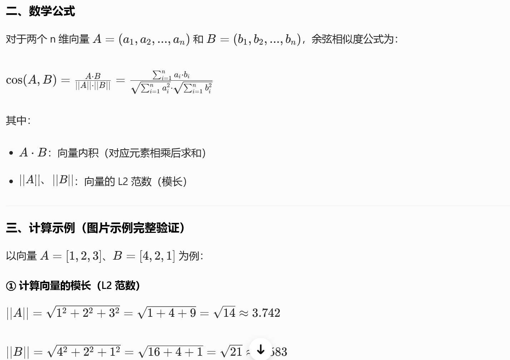
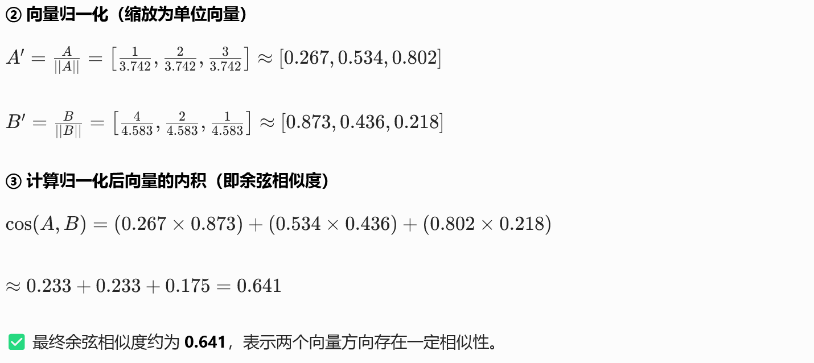

alias:: Inner Product旧笔记, 余弦相似度旧笔记
type:: concept
status:: archived
updated:: 2026-05-03

- **迁移说明**
	- 本页标题是内积，但旧内容主要在讲余弦相似度；稳定内容已分别整理到 [[Concept/内积]] 和 [[Concept/余弦相似度]]。
	- 后续学习和复习优先维护新页面；本页保留为原始资料和历史上下文。

- 核心定义
	- 余弦相似度通过计算两个向量**夹角的余弦值**，衡量向量在**方向上的相似程度**，与向量的绝对长度无关。
	- **核心规律**：值越接近 `1`，向量方向越一致，语义越相似；值越接近 `-1`，方向越相反；`0` 表示向量垂直、无关联。
- 计算方式
	- 
	- 
- 适用场景
	- 适用于**向量方向代表语义 / 特征，数值大小无实际意义**的场景，是**RAG 文本检索的首选度量方式**：
	- 文本语义相似度计算（如 BERT、Word2Vec 生成的 Embedding 向量）
	- 文档检索、问答系统、推荐系统
	- 所有以 “语义方向” 为核心的向量检索场景
-
