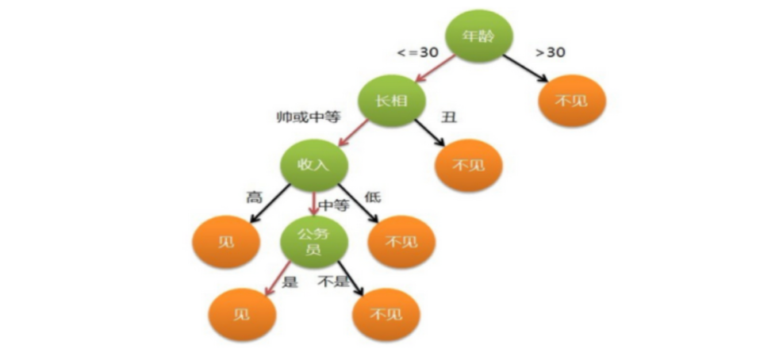

alias::
tags:: 机器学习, 模型本身, 兼顾回归分类, 监督学习算法
type:: 概念
status:: 草稿

- 决策树是一类**监督学习模型**，既可以做分类，也可以做回归，核心逻辑：**通过一系列「if-else」判断规则，把数据层层划分，最终得到预测结果**
- 比如：你母亲要给你介绍男朋友，是这么来对话的：
	- ```text
	  - 女儿：多大年纪了？
	  - 母亲：26。
	  - 女儿：长的帅不帅？
	  - 母亲：挺帅的。
	  - 女儿：收入高不？
	  - 母亲：不算很高，中等情况。
	  - 女儿：是公务员不？
	  - 母亲：是，在税务局上班呢。
	  - 女儿：那好，我去见见。
	  ```
	- 于是你在脑袋里面就有了下面这张图：
	- {:height 354, :width 748}
- 分类
	- [[ID3决策树]]
	- [[C4.5决策树]]
	- [[CART决策树]]
	- [[回归决策树]]
- 决策树剪枝
	- 剪枝 (pruning)是决策树学习算法对付 **过拟合** 的主要手段。
		- 预剪枝
		- 后剪枝