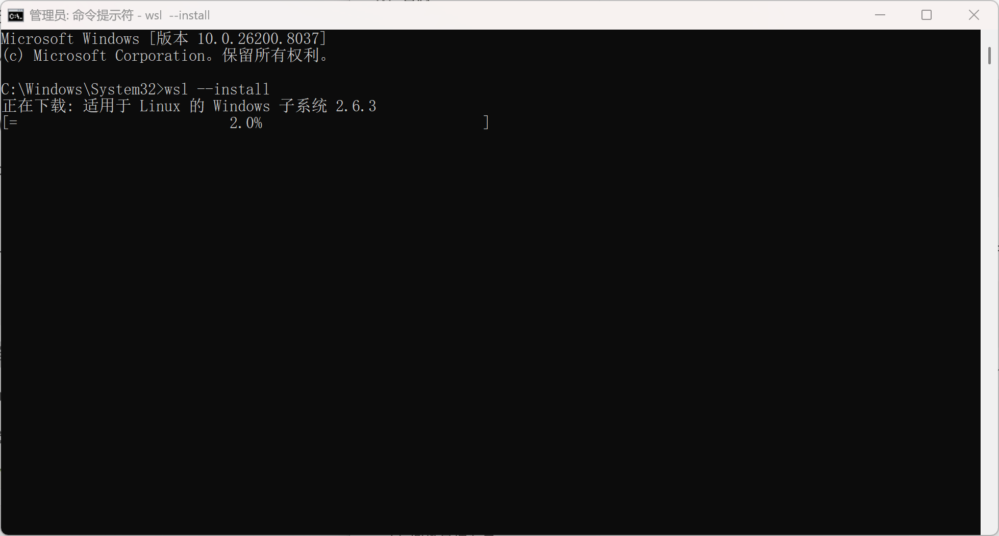
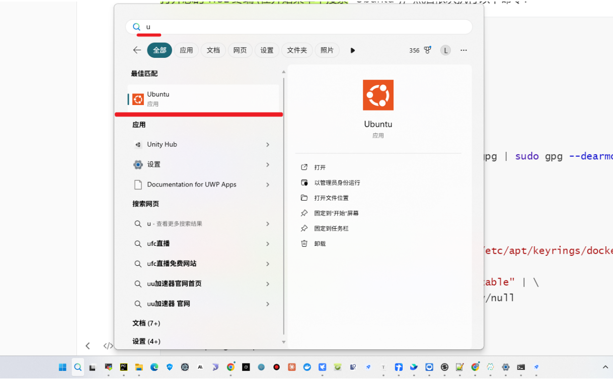

alias::
tags:: 虚拟机
type:: 概念
status:: 草稿

- 安装WSL 2
	- 自动化安装
	  collapsed:: true
		- 以 **管理员身份** 打开 PowerShell，然后运行
		  id:: 69cb3c65-0edf-4ebb-aa01-6166af1d8d60
		- ```cmd
		  wsl --install
		  ```
		- 根据提示重启计算机。这会自动安装 Ubuntu 发行版。
		- 
		- 
	- 手动导入本地Ubuntu
	  id:: 69cb4619-d96c-4124-8105-3421ae3642dc
	  collapsed:: true
		- 开启WSL功能：下载并安装WSL 内核
			- ```CMD
			  wsl --install --no-distribution
			  ```
			- `--no-distribution`：只开启 WSL 功能，**不自动下载 Ubuntu**
		- 导入本地Ubuntu
			- ```cmd
			  wsl --import Ubuntu-22.04 D:\WSL\Ubuntu-22.04 D:\Downloads\ubuntu-22.04.5-wsl-amd64.wsl
			  ```
		- 启动Ubuntu
			- ```cmd
			  wsl.exe -d Ubuntu
			  ```
- 安装Docker
	- ```sh
	  # 更新软件包列表
	  sudo apt-get update
	  
	  # 安装必要的依赖
	  sudo apt-get install -y ca-certificates curl gnupg
	  
	  # 添加 Docker 的官方 GPG 密钥
	  sudo install -m 0755 -d /etc/apt/keyrings
	  curl -fsSL https://download.docker.com/linux/ubuntu/gpg | sudo gpg --dearmor -o /etc/apt/keyrings/docker.gpg
	  sudo chmod a+r /etc/apt/keyrings/docker.gpg
	  
	  # 设置 Docker 的 APT 仓库
	  echo \
	    "deb [arch=$(dpkg --print-architecture) signed-by=/etc/apt/keyrings/docker.gpg] https://download.docker.com/linux/ubuntu \
	    $(. /etc/os-release && echo "$VERSION_CODENAME") stable" | \
	    sudo tee /etc/apt/sources.list.d/docker.list > /dev/null
	  
	  # 再次更新软件包列表
	  sudo apt-get update
	  
	  # 安装 Docker 引擎, CLI, 和 Compose
	  sudo apt-get install -y docker-ce docker-ce-cli containerd.io docker-buildx-plugin docker-compose-plugin
	  ```
- 添加国内镜像源
	- ```sh
	  # 在ubuntu上进行执行以下命令，进行编辑： 
	  sudo vim /etc/docker/daemon.json
	  ```
	- 输入
	- ```text
	  {
	      "registry-mirrors": [
	              "https://docker.211678.top",
	              "https://docker.1panel.live",
	              "https://hub.rat.dev",
	              "https://docker.m.daocloud.io",
	              "https://do.nark.eu.org",
	              "https://dockerpull.com",
	              "https://dockerproxy.cn",
	              "https://docker.awsl9527.cn"
	        ]
	  }
	  ```
- 重启让镜像源生效
	- ```sh
	  sudo systemctl daemon-reload
	  sudo systemctl restart docker
	  ```
- 通过` docker-compose.yaml`启动镜像
	- ```sh
	  #启动
	  sudo docker compose up -d
	  
	  # 查看服务状态
	  sudo docker compose ps
	  
	  # 停止容器
	  sudo docker compose stop
	  
	  # 重启容器
	  sudo docker compose restart
	  
	  # 停止并移除容器
	  sudo docker compose down
	  
	  # 停止并删除所有数据
	  sudo docker compose down -v
	  ```
- 启动Docker服务
	- 方式1：每次启动WSL执行命令启动Docker服务
		- ```cmd
		  sudo systemctl start docker
		  ```
	- 方式2：设置docker开机自启
		- ```cmd
		  sudo systemctl enable docker
		  ```
- 安装大模型依赖，`requirement.txt`
	- ```text
	  accelerate==1.9.0
	  aiohappyeyeballs==2.6.1
	  aiohttp==3.12.15
	  aiosignal==1.4.0
	  altair==5.5.0
	  annotated-types==0.7.0
	  anthropic==0.60.0
	  anyio==4.9.0
	  asttokens==3.0.0
	  attrs==25.3.0
	  beautifulsoup4==4.13.4
	  blinker==1.9.0
	  boto3==1.39.16
	  botocore==1.39.16
	  bs4==0.0.2
	  cachetools==6.1.0
	  certifi==2025.7.14
	  cffi==1.17.1
	  charset-normalizer==3.4.2
	  click==8.2.1
	  colorama==0.4.6
	  colorlog==6.9.0
	  comm==0.2.3
	  cryptography==45.0.5
	  dashscope==1.24.0
	  dataclasses-json==0.6.7
	  datasets==4.0.0
	  debugpy==1.8.15
	  decorator==5.2.1
	  dill==0.3.8
	  diskcache==5.6.3
	  distro==1.9.0
	  executing==2.2.0
	  fastapi==0.116.1
	  filelock==3.18.0
	  Flask==3.1.1
	  frozenlist==1.7.0
	  fsspec==2025.3.0
	  gitdb==4.0.12
	  GitPython==3.1.45
	  greenlet==3.2.3
	  h11==0.16.0
	  hf-xet==1.1.5
	  httpcore==1.0.9
	  httpx==0.28.1
	  httpx-sse==0.4.1
	  huggingface-hub==0.34.3
	  idna==3.10
	  ipykernel==6.30.0
	  ipython==9.4.0
	  ipython_pygments_lexers==1.1.1
	  itsdangerous==2.2.0
	  jedi==0.19.2
	  Jinja2==3.1.6
	  jiter==0.10.0
	  jmespath==1.0.1
	  joblib==1.5.1
	  jsonpatch==1.33
	  jsonpointer==3.0.0
	  jsonschema==4.25.0
	  jsonschema-specifications==2025.4.1
	  jupyter_client==8.6.3
	  jupyter_core==5.8.1
	  langchain==0.3.26
	  langchain-community==0.3.27
	  langchain-core==0.3.72
	  langchain-deepseek==0.1.4
	  langchain-openai==0.3.28
	  langchain-text-splitters==0.3.9
	  langgraph==0.4.8
	  langgraph-checkpoint==2.1.1
	  langgraph-prebuilt==0.6.2
	  langgraph-sdk==0.2.0
	  langsmith==0.3.45
	  # llama_cpp_python==0.3.16
	  lxml==6.0.0
	  MarkupSafe==3.0.2
	  marshmallow==3.26.1
	  matplotlib-inline==0.1.7
	  mcp==1.8.0
	  mcp-server==0.1.4
	  mpmath==1.3.0
	  multidict==6.6.3
	  multiprocess==0.70.16
	  mypy_extensions==1.1.0
	  mysql-connector-python==9.4.0
	  mysqlclient==2.2.7
	  narwhals==2.0.1
	  nest-asyncio==1.6.0
	  networkx==3.5
	  nltk==3.9.1
	  numpy==2.3.2
	  openai==1.97.1
	  optimum==1.27.0
	  orjson==3.11.1
	  ormsgpack==1.10.0
	  packaging==25.0
	  pandas==2.3.1
	  parso==0.8.4
	  peft==0.11.1
	  pillow==11.3.0
	  platformdirs==4.3.8
	  plotly==5.18.0
	  prompt_toolkit==3.0.51
	  propcache==0.3.2
	  protobuf==6.31.1
	  psutil==7.0.0
	  pure_eval==0.2.3
	  pyarrow==21.0.0
	  pycparser==2.22
	  pydantic==2.11.7
	  pydantic-settings==2.10.1
	  pydantic_core==2.33.2
	  pydeck==0.9.1
	  Pygments==2.19.2
	  PyMySQL==1.1.1
	  python-a2a==0.5.4
	  python-dateutil==2.9.0.post0
	  python-dotenv==1.1.1
	  python-multipart==0.0.20
	  pytz==2025.2
	  pywin32==311
	  PyYAML==6.0.2
	  pyzmq==27.0.0
	  referencing==0.36.2
	  regex==2025.7.31
	  requests==2.32.4
	  requests-toolbelt==1.0.0
	  rouge==1.0.1
	  rouge-chinese==1.0.3
	  rpds-py==0.26.0
	  s3transfer==0.13.1
	  safetensors==0.5.3
	  schedule==1.2.2
	  setuptools==78.1.1
	  six==1.17.0
	  smmap==5.0.2
	  sniffio==1.3.1
	  soupsieve==2.7
	  SQLAlchemy==2.0.42
	  sse-starlette==3.0.2
	  stack-data==0.6.3
	  starlette==0.47.2
	  streamlit==1.47.1
	  sympy==1.14.0
	  tenacity==9.1.2
	  tiktoken==0.9.0
	  tokenizers==0.21.4
	  toml==0.10.2
	  torch==2.7.1
	  tornado==6.5.1
	  tqdm==4.67.1
	  traitlets==5.14.3
	  transformers==4.54.1
	  typing-inspect==0.9.0
	  typing-inspection==0.4.1
	  typing_extensions==4.14.1
	  tzdata==2025.2
	  urllib3==2.5.0
	  uvicorn==0.35.0
	  watchdog==6.0.0
	  wcwidth==0.2.13
	  websocket-client==1.8.0
	  Werkzeug==3.1.3
	  wheel==0.45.1
	  xxhash==3.5.0
	  yarl==1.20.1
	  zstandard==0.23.0
	  
	  ```
	- 执行命令`pip install -r requirements.txt`