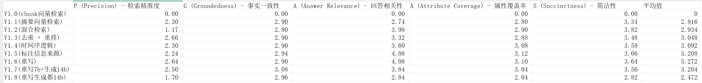
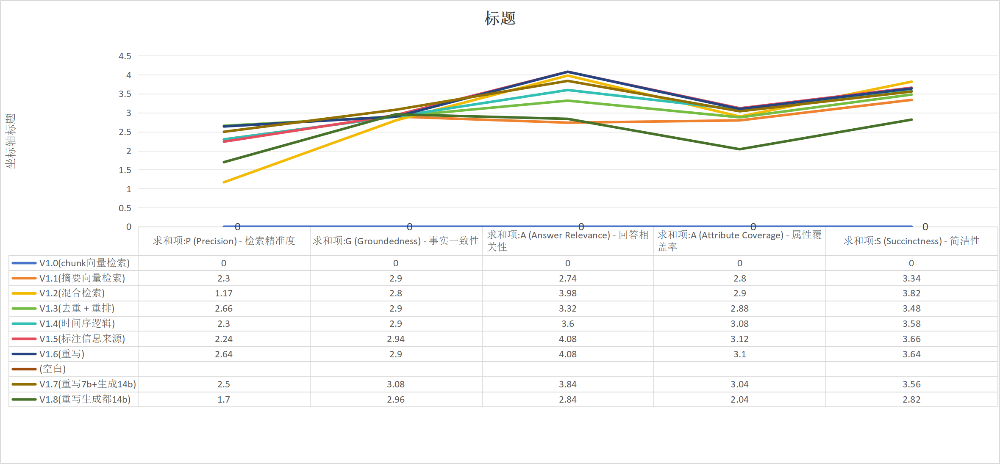

- 
- 
- 检索污染：
	- 异常表现：在引入 BM25 混合检索后，**P (检索精准度)** 居然从 V1.1 的 **2.30** 直接腰斩到了 **1.17**。
	- 原因分析：这是典型的“检索污染”。
		- 在《凡人》这种文本中，BM25 可能会搜到大量包含“韩立”、“灵气”但与问题无关的废话片段。
		- 关键问题：你当时可能只是简单地将向量结果和 BM25 结果合并，而**没有做 RRF (倒数排名融合) 或归一化权重**。低质量的 BM25 结果挤掉了高质量的向量结果，导致精准度断崖式下跌。
	- 解决办法：做 [[RRF]] (倒数排名融合) 或[[归一化权重]]
- 重写漂移
	- 异常表现：按常理，14b 的逻辑能力远超 7b。但数据中：
		- **V1.7 (重写7b+生成14b)** 的平均分 (3.204) 竟然低于 **V1.6 (纯7b)** 的平均分 (3.272)。
		- **V1.8 (重写生成全用14b)** 更是出现了灾难性的跌落：**P 分跌至 1.70，A 分跌至 2.04**，平均分直接掉回了 V1.1 的水平。
	- 原因分析：
		- **指令过载/格式不兼容**：14b 对 Prompt 的敏感度更高。如果你给 14b 的 Prompt 还是原来给 7b 的那一套，14b 可能会因为过于“发散”或试图进行更复杂的推理，反而导致回答不简洁（S分跌）、属性覆盖不全（A分跌）。
		- **重写漂移**：V1.8 让 14b 负责重写，可能因为 14b 重写的关键词**太超前或太复杂**，超出了你的 `m3e-base` 嵌入模型的理解范围，导致搜回来的东西完全不对（P分暴跌）。
			- 7b 比较“笨”，重写出来的关键词通常很直接（如：韩立 乱星海 噬金虫）。
			- 14b 懂的太多，它在重写时可能会加入大量**文学性修辞**或**深层逻辑推论**（例如：韩立 心理博弈 战术撤退 虚天殿危机）。
			- **后果**：`m3e-base` 作为一个基础 Embedding 模型，对这种高阶语义的“捕捉力”有限。它反而更喜欢 7b 那种简单粗暴的关键词。14b 的聪明反而误导了检索，导致搜回来的 Chunk 质量大幅下降。
		- 解决办法：
			- 重写阶段**退回使用 7b**，或者严格限制 14b 的重写 Prompt。
				- 强制要求 14b 只能输出“名词短语”，严禁输出描述性句子。
				- **目标**：让检索关键词重新回归到 `m3e-base` 能听懂的水平。
- 事实一致性：
	- **异常表现**：从 V1.1 到 V1.6，，但 **G 分** 几乎像死水一样纹丝不动（从 2.90 挪到了 2.90）。直到上 14b 才勉强到了 3.08。
	- 原因分析：
		- **切片信息熵不足**：说明 600+100 的切片大小，对于判断《凡人》这种讲究前因后果的逻辑来说，还是**太孤立了**。
		- AI 虽然找对了片段，但片段里只有“果”，没有“因”，所以它只能靠猜。这就是为什么我之前建议你做“父子块扩容”，不扩容，G 分永远上不去。
- S (简洁性) 与 G (事实一致性) 的强耦合异常
	- **异常表现**：在 V1.8 中，**S 分 (2.82)** 和 **G 分 (2.96)** 同时大幅下滑。
	- **原因分析**：这说明模型开始“胡言乱语”了。当一个强模型（14b）拿到了错误的检索资料（P分低），它会试图用大量的废话去圆谎（导致 S 分降），但圆不回来（导致 G 分降）。
- A 分与 S 分同步暴跌 (属性覆盖与简洁性)
	- **异常表现**：V1.8 的 A 分从 3.10 跌到 2.04，S 分从 3.64 跌到 2.82。
	- **深度原因**：**检索垃圾进，生成垃圾出 (GIGO)**。
		- 因为 P 分（检索）崩了，14b 拿到的 5 个 Chunk 根本不含答案。
		- 但 14b 拥有极强的**“自作聪明”**倾向。它发现资料里没答案，由于它参数量大，它会尝试用自己的“原生记忆”（Pre-train 阶段读过的网络小说）去填补。
		- 这导致它写了大量与当前 Chunk 无关的废话（S 分跌），且因为不是基于检索的事实，考据属性自然对不上号（A 分跌）。
- G 分（事实一致性）的虚假坚挺 (2.96)
	- **异常表现**：虽然检索全崩了，但 G 分居然还维持在 2.96（甚至比 V1.6 略高一点）。
	- **深度原因**：**逻辑自洽的幻觉**。
		- 14b 的语言组织能力太强了，它能把“瞎编”的内容写得逻辑极其严密。
		- 评估脚本可能判断它“逻辑通顺、没有前后矛盾”，给了不错的 G 分，但实际上它已经脱离了你给的“凡人”资料库。
	- 解决办法：引入“[[检索后过滤]]” (Post-Retrieval Filter)
		- 如果 Top 1 的 BGE 分数低于某个阈值（比如 `0.3`），直接让 14b 回答“不知道”，而不是强行推论。
		- **目标**：止损，防止 14b 开始用原生记忆进行“创作”。
-