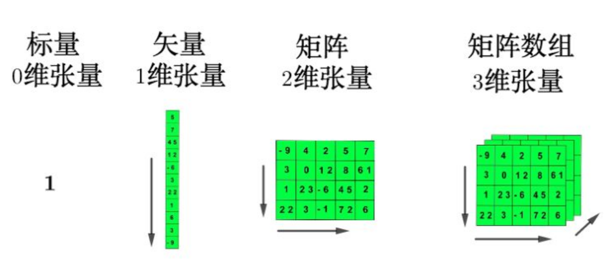

tags:: PyTorch
type:: 概念
status:: 草稿

- 创建
	- 是什么？
	  collapsed:: true
		- Tensor 是[[深度学习]]的**核心数据载体**
		- PyTorch中的张量就是元素为同一种数据类型的**多维矩阵**，与NumPy数组类似。
		- 
	- 数据类型
	  collapsed:: true
		- | 数据类型 | 别名 (dtype) | CPU 张量类型 | GPU 张量类型 | 说明与适用场景 |
		  | ---- | ---- | ---- |
		  | **32 位浮点型** | `torch.float32` / `torch.float` | `torch.FloatTensor` | `torch.cuda.FloatTensor` | **默认类型**，训练主流，平衡精度与速度 |
		  | **64 位浮点型** | `torch.float64` / `torch.double` | `torch.DoubleTensor` | `torch.cuda.DoubleTensor` | 高精度计算，需极高精度时使用，占用显存大 |
		  | **16 位浮点型** | `torch.float16` / `torch.half` | `torch.HalfTensor` | `cuda.HalfTensor` | 半精度，用于**混合精度训练**，大幅节省显存 |
		  | **8 位无符号整型** | `torch.uint8` | `torch.ByteTensor` | `torch.cuda.ByteTensor` | 无符号，范围 0-255，**图像像素**专用 |
		  | **8 位有符号整型** | `torch.int8` | `torch.CharTensor` | `torch.cuda.CharTensor` | 有符号，范围 -128~127，量化模型存储 |
		  | **16 位有符号整型** | `torch.int16` / `torch.short` | `torch.ShortTensor` | `torch.cuda.ShortTensor` | 短整型，低精度整数存储 |
		  | **32 位有符号整型** | `torch.int32` / `torch.int` | `torch.IntTensor` | `torch.cuda.IntTensor` | 常用整数，索引、形状维度等常规整数 |
		  | **64 位有符号整型** | `torch.int64` / `torch.long` | `torch.LongTensor` | `torch.cuda.LongTensor` | **长整型**，分类任务标签、大索引、坐标等 |
		- 💡 关键总结
			- **默认类型**：创建张量时若不指定，默认为 `torch.float32`。
			- **设备转换**：通过 `.to("cuda")` 或 `.cuda()` 将 CPU 张量转为 GPU 张量，类名前缀自动变为 `cuda.`。
			- **选型口诀**：
				- **训练 / 推理**：用 `float32`（默认）；
				- **省显存**：用 `float16`（混合精度）；
				- **标签 / 索引**：用 `int64` (long)；
				- **图像输入**：用 `uint8`。
	- 创建方式
		- ```python
		  import torch
		  
		  # 0维张量（标量）
		  t0 = torch.tensor(5)
		  # 1维张量（向量，比如单个token的id）
		  t1 = torch.tensor([101, 2003, 102])
		  # 2维张量（矩阵，比如batch=2的输入id）
		  t2 = torch.tensor([[101, 2003, 102], [101, 3004, 102]])
		  print(t2.shape)  # 输出 torch.Size([2, 3]) → 2行3列
		  ```
		- 创建指定类型的张量
		  collapsed:: true
			- ```python
			  # 1. 创建2行3列, dtype 为 int32 的张量
			  data = torch.IntTensor(2, 3)
			  print(data)
			  # 2. 注意: 如果传递的元素类型不正确, 则会进行类型转换
			  data = torch.IntTensor([2.5, 3.3])
			  print(data)
			  # 3. 其他的类型
			  data = torch.ShortTensor()  # int16
			  data = torch.LongTensor()   # int64
			  data = torch.FloatTensor()  # float32
			  data = torch.DoubleTensor() # float64
			  ```
-