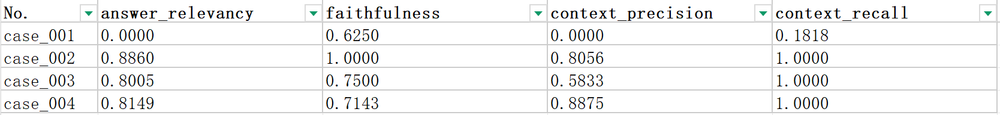
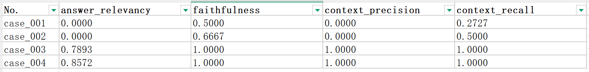
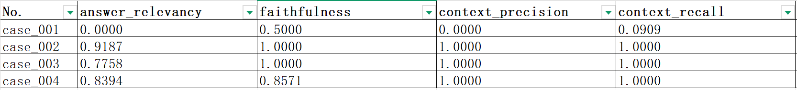
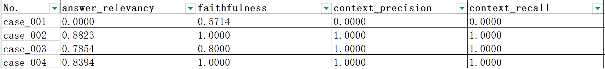
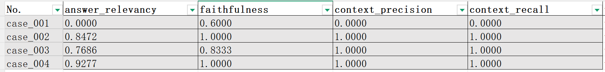
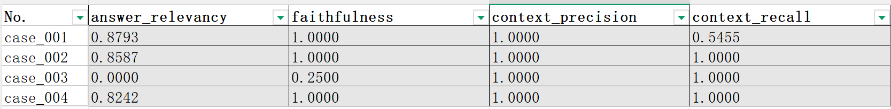
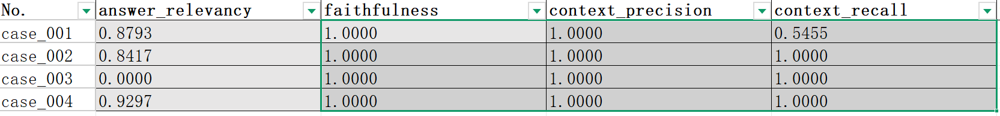
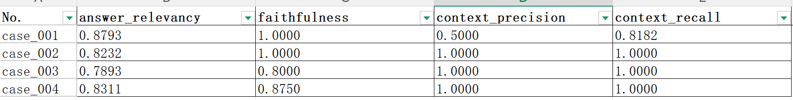

alias::
tags:: 项目实战
type:: 概念
status:: 草稿
id:: 69c22d6f-173d-407f-a67e-613cbe148bf9

- 为了方便了解手册文本类RAG的工作原理，笔者特意写了这篇文章，在开始实战之前，我们必须了了解如下知识：
	- 什么是[[RAGAS]]？
	- 准备评估数据，这里我们使用大模型来生成评估案例，具体的prompt，参考： [[评估案例Prompt]]
- 了解评估案例和评估指标后，我们就可以开始对评估结果进行分析了，作者特意下载了python的使用手册，该手册内容作为本次rag系统的知识库
	- 本次 ((69c1fa16-8e0c-42f1-9dfa-dbdcb1efafd8)) 使用Gemini生成，依据 ((69c1fbff-f191-402f-9be5-5948810524dc)) 生成
- 好，接下来开始我们的评估和优化之路。看下图告诉我你的分析情况：
	- 图1
	- 
- 思考5分钟，好了，接下来笔者说说自己的第一印象
	- 笔者看到这份报告的第一印象就是`case_002~004`的[[召回率]]真高，紧接着想到[[准确率]]不高，极大概率是`TopK`召回里面存在垃圾信息。
	- 可能由 ((69c24db2-a7cc-4818-8861-a5602a73b926)) 引起，具体原因需要结合评估日志来来确定病灶；不过即使没有评估日志，我们依然有提高[[准确率]]的方法。
	- 虽然检索层把相关的片段都召回了，但同时也召回许多不相关的，针对这种情况我们的理想做法就是将相关的留下，不相关的过滤掉，借此拯救下[[准确率]]。
- 接下来就是：“大胆假设，小心求证。”
	- 我们给我们的rag系统引入[[重排序]]，由于当前我们的（[[混合检索]]）配置为各路都是Top5，合计Top10数据量较小，所以没有引入 [[RRF]] 的必要，我们直接对召回的结果进行[[精排]]。同时我们需要确认过滤阈值，这里我们使用业界的经验值`0.3`，那么重排的时候就会过滤掉分数低于0.3的chunk。
- **重排序熔断**之后的评估结果
	- 图2
	- 
- 从图2可以看出，引入重排序熔断的效果非常明显，`case_003`和`case_004`的[[准确率]]有了极大提升，同时带动了[[真实性]]的提升，这是因为重排熔断，提高了召回信息纯度。但是`caset_002`的召回率和准去率都下降了，说明了重排序熔断将`caset_002`的召回信息中有部分**有用但是评分却很低**，这是时候我们需要去看看评估日志，经过查看我们发现是这两个本属于同一段话却因为chunksize刚好被切分为了2部分，被过滤掉的这部分因为切分后缺失关键特征信息，所以评分很低就被过滤掉了。
- **调整切分策略**，使用企业经验值`ChunkSize = 500`，`overlap = 20%`
	- 图3
	- 
- 调整切分策略后，提高了召回率和准确率，得益于较长的ChunkSize使chunk的特征更加明显，检索时chunk和问题的相关性越强，而较长的chunkdsize也会导致chunk的纯度略有下降，从`case_004`能够看出来说明所有答案的所有信息点已经被检索回来，且没有召回垃圾chunk，这些都得益于chunksize设置的合理使chunk特征明显方便检索，但同时也带来了一点不足，如chunk的纯度有所下降，这一点从`case_004`能够看出来，往往我们需要在纯度和精确度之间进行抉择。
- 同时我们发现`case_001`，的召回率急速下降，说明`ChunkSize 并非越大越好。适度增大 ChunkSize 能够提升文本块的语义完整性与语义特征丰富度，从而有助于保障检索的召回率与准确率；但 ChunkSize 过大会导致无关信息占比上升、信噪比（SNR）降低，进而降低检索结果的真实性与可靠性。`
- 查看评估日志知道是因为相关的chunk没有被召回，猜测可能是因为chunksize增大，导致出现频次较低的关键字被淹没
- **chunk头加上章节信息再次评估**
	- 图4
	- 
- 竟然毫无作用，经查阅资料得知`关键词检索`如`BM25`会将`⚠️5.1拆分为两个独立词项：5和1`导致即使加上章节信息`5.1 xxx`也无法提高检索。
- 于是笔者去搜索了以下，企业级开发当中是怎么做的，发现企业中使用的是[[自查询检索]]，于是笔者打算先做**摘要向量**试试
	- 图5
	- 
- 图5是做完摘要向量的结果，发现没有效果，主要原因：**向量检索的 “语义相似” 而非 “内容相关”**，即使提取摘要其语义是不会变得所以，遇到这种问题，重点是要进一步缩小范围
	- 就比如SQL查询时，使用contain检索到大量非预期数据，那么这时候我们该想的办法再添加过滤条件缩小范围
- 于是笔者决定在使用[[自查询检索]]
	- 图6
	- 
	- 这次的评估结果得到的极大的进步，[[准确率]]直接拉满，那么说明召回的内容都是相关的；召回率不高说明相关信息评分不高，被重排熔断过滤掉了。所以笔者计算降低熔断阈值
- **降低熔断阈值**
	- 图7
	- 
	- 降低熔断阈值之后，发现没有效果，查看评估日志，发现主要原因**相关的信息分数低略低于阈值同时被rerank的topk同时限制**，所以接下来笔者计划提高召回数量，由5变为8
- **提高`Top K`的数量**
	- 图8
	- 
	- 由此发现提高提高`Top K`确实可以提高召回率但同时也会降低真实性，所以这时候就需要抉择了，到此也就结束了
- **总结**
	- 1、开始只用向量检索，召回率高，准确性不足，虽然答案所需信息均被召回，但召回内容不纯，于是我们采用重排熔断，对召回内容进行过滤，将相关性不高的信息剔除。
	- 2、重排熔断之后发现召回率、准确性均有所下降，说明有些相关信息，因为评分不高被排除在外；根本原因是由于完整的一段话被切分为2段，而切分后因为语义特征不明显所以被剔除，为了增强语义特征提高`chunksize`使用当前主流认知：`chunksize = 500，overlap = 20%`
	- 3、我们发现调大`chunksize`发现关键字检索的准确率有所下降，原因：由于`chunk`变长，关键字被稀释，导致关键字检索的准确率下降，`BM25`分词的局限
	- 4、解决步骤3中的问题，我们采用[[自查询检索]]，通过metadata过滤来来缩小检索范围（类似mysql中增加过滤条件），准确率直接拉满，召回率不足，说明答案需要的所有信息没有全召回，但是召回的都是相关的，说明我们的`Top-K`设置的比较低
	- 提高`Top k`会提高召回率，但是会降低准确性和真实性
- **坑点**
	- 语义向量评分低，使用摘要也无能为力，因为摘要是提纯语义不是修改语义，只要语义不变它的评分就不变，那么摘要的主要作用就是强化语义特征
	- ChunkSize 并非越大越好。适度增大 ChunkSize 能够提升文本块的语义完整性与语义特征丰富度，从而有助于保障检索的召回率与准确率；但 ChunkSize 过大会导致无关信息占比上升、信噪比（SNR）降低，进而降低检索结果的真实性与可靠性。
	- `关键词检索`如`BM25`会将`⚠️5.1拆分为两个独立词项：5和1`导致即使加上章节信息`5.1 xxx`也无法提高检索。这也是关键字检索失效的一个原因
	  id:: 69c74054-0e47-45f5-a7ce-a6c121afb21b