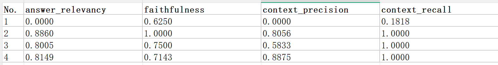

alias::
tags:: 项目实战
type:: 概念
status:: 草稿
id:: 69c22d6f-173d-407f-a67e-613cbe148bf9

- 为了方便了解手册文本类RAG的工作原理，笔者特意写了这篇文章，在开始实战之前，我们必须了了解如下知识：
	- 什么是[[RAGAS]]？
	- 准备评估数据，这里我们使用大模型来生成评估案例，具体的prompt，参考： [[评估案例Prompt]]
- 了解评估案例和评估指标后，我们就可以开始对评估结果进行分析了，作者特意下载了python的使用手册，该手册内容作为本次rag系统的知识库
	- 本次 ((69c1fa16-8e0c-42f1-9dfa-dbdcb1efafd8)) 使用Gemini生成，依据 ((69c1fbff-f191-402f-9be5-5948810524dc)) 生成
- 好，接下来开始我们的评估和优化之路。看下图告诉我你的分析情况：
- 
- 思考5分钟，好了，接下来笔者说说自己的第一印象
	- 笔者看到这份报告的第一印象就是No.2~4的[[召回率]]真高，紧接着想到[[准确率]]不高，极大概率是`TopK`召回里面存在垃圾信息。
	- 可能由 ((69c24db2-a7cc-4818-8861-a5602a73b926)) 引起，具体原因需要结合评估日志来来确定病灶；不过即使没有评估日志，我们依然有提高[[准确率]]的方法。
	- 检索层把相关的片段都召回了，同时也召回许多不相关的，针对这种情况我们的理想做法就是将相关的留下，不相关的过滤掉，借此拯救下[[准确率]]。
- 接下来就是：**“大胆假设，小心求证。”**，接下来我们给我们的rag系统引入[[重排序]]
	-
	-
	-
	-
	-
	-
	-
	-
	-
	-
	-
	- 接着看到的就是No.1的召回率这么低的情况下,[[真实性]]却达到0.62,觉得人家prompt因该考虑到了`若上下文无足够信息回答问题，直接回复‘暂无相关信息’，禁止编造 / 推断任何内容`，而出现极少数召回率低大概率是关键字不敏感导致
- 好了，接下聊聊解决方案
	- 利用老胡的话来说就是：**“大胆假设，小心求证。”**
	- 首先判断No.2~4这种`过度召回`是**全局性还是局部性**的，根据**业务确定**长尾查询占比如何，然后再决定采用何种方式来优化，大体上分为如下2种：
		- | 适用场景 | 优化手段 | 风险 |
		  | ---- | ---- | ---- |
		  | 全局性过召回（多数样本都出现低精确率） | **减少 top_k** | 可能牺牲个别[[长尾查询]]的召回率 |
		  | 局部过召回（仅部分样本受影响） | **重排 + 熔断** | 增加推理延迟，需额外部署 reranker |
	- 对于No.1，尽管我们猜测是关键字不敏感导致，但我们仍需进一步分析评估日志才能确定病灶（如检索召回的 chunk 是否包含专有名词相关内容、关键词检索阶段是否命中对应文档等），如确诊是关键字不敏感导致，那么就需进一步分析是开启[[混合检索]]，还是混合检索中关键词 / 向量的权重分配失衡，未给到专有名词足够的匹配权重。
- 既然已经分析到了这里，那么我们开始优化，因为笔者当前案例数量有限，所以无法确认召回率偏高是全局性还是局部性的
- 笔者建议：
	- 以**重排熔断**为主，不过这个需要增加[[重排序]]部署，增加模型后势必增加[[首字延迟]]。如果`过度召回`属于局部、长尾查询占比低、同时不想增加系统复杂度、对首字延迟要求高的话，再考虑减少`top_k`。
- DOING 实施策略：
  :LOGBOOK:
  CLOCK: [2026-03-24 Tue 15:53:15]
  :END:
	- 重排序模型建议选择`bge-reranker`系列，**轻量、快速、中文友好**，如果主打追求轻量、高效可以选择第一代产品`bge-reranker-base`,追求多语言、超长文本、性能可以选择其第二代产品`bge-reranker-v2-m3 `,详情参考：[[重排序]]
	- 混合检索