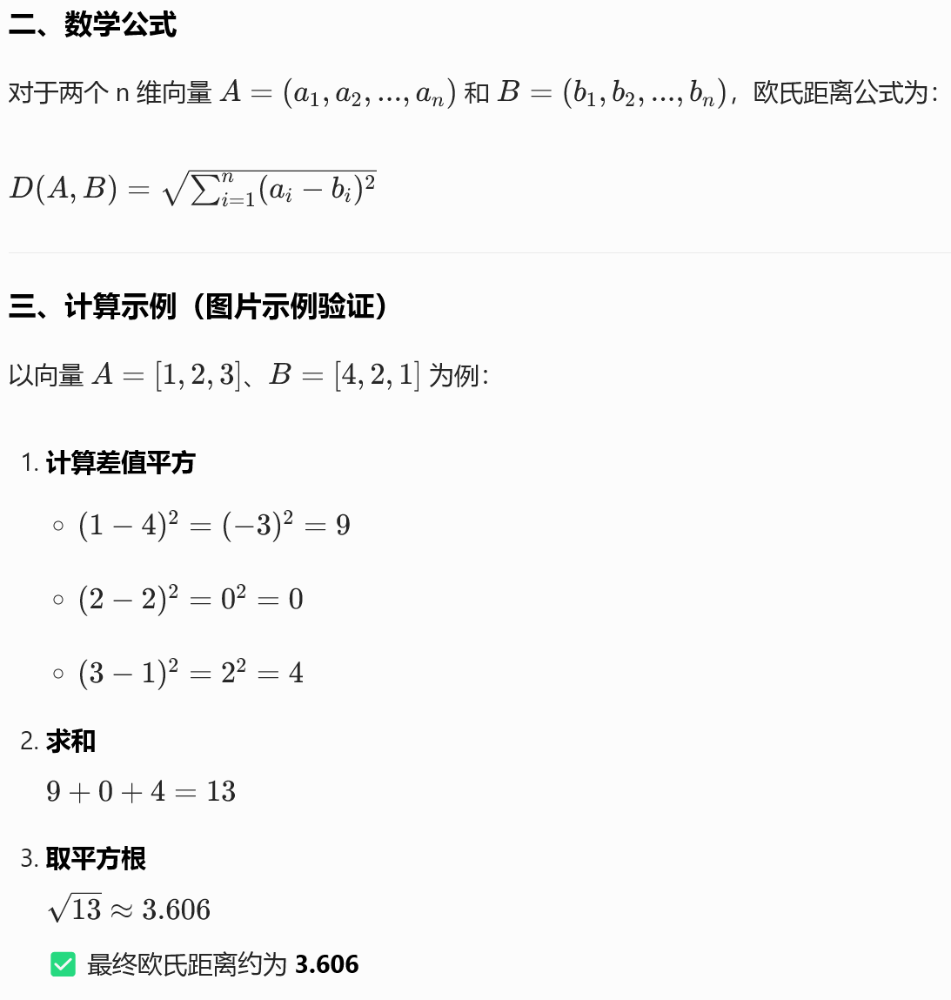

alias:: Euclidean Distance
tags:: 相似度度量方式
type:: 概念
status:: 草稿

- 核心定义
	- 欧氏距离是衡量**n 维空间中两个向量之间的直线距离**的指标，是最直观的相似度度量方式之一
	- **核心规律**：欧氏距离，直线距离。值越小，越相似。
- 计算公式
	- 如果是2维那就是`勾股定理`
	- 
- 适用场景
	- 适用于**向量的数值大小本身有实际意义**的场景，例如：
	- 图像识别（像素值为实际特征）
	- 物理世界坐标（如 GPS 定位、空间坐标计算）
	- 数值型特征的相似度计算（如用户消费金额、商品属性等）