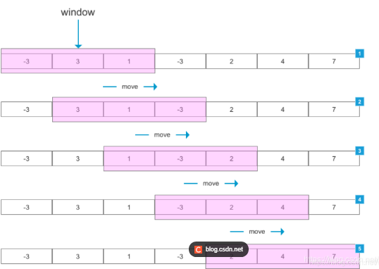

alias::
tags:: 大模型, RAG
type:: 概念
status:: 草稿 | 整理中 | 已掌握

	- ## 🧠 一句话说清楚（费曼）
		- 假设窗户外面有个传送带，传送带上面放着文字，不断的在转动，而你只能看到传送带正对面的内容，那么这个窗口就是滑动窗口。
		- 
		- 假设你通过窗口能看到10行（每行50个文字），那么你就可以看到总计10 * 50 = 500个文字，那么这500个文字就是**窗口大小（chunk_size）**
		- 假设传送带以6行每次的速度在转动，那么**滑动步长** = 6 * 50 = 300；那么上次转动就有500 - 300 = 200留在窗口内没有走出去，这未走出去的200就叫重叠。**重叠（overlap）= chunk_size（500 ） - 滑动步长（300）**。
	- ## 💘企业开发场景
	  collapsed:: true
		- {{实际企业开发当中的场景，按常见度由高往低排序，低于10%的场景不记录}}
		- {{场景一： xxxxxxxx}}
		- {{企业实现：xxxxxxxx}}
	- ## ⚠️易错/易混点（复习必看）
		- {{}}
	- ## 🔁核心原理/流程（极简版）
		- {{原理简述}}
	- ##  📘 核心概念（官方）
		- {{官方说法}}
	- ## 🔍 核心作用（解决什么问题）
	  collapsed:: true
		- {{能解决企业开发当中的什么问题}}
	- ## 🪡关键特点（优缺点）
	  collapsed:: true
		- ### 优点
			- {{捡重要的说，最多3条，多了记不住}}
			- {{1、 xxxx}}
			- {{2、 xxxx}}
			- {{3、 xxxx}}
		- ### 缺点
			- {{捡重要的说，最多3条，多了记不住}}
			- {{1、 xxxx}}
			- {{2、 xxxx}}
			- {{3、 xxxx}}
	- ## 📝 面试题（自问自答）
	  Q:   
	  A:  
	  
	  Q:  
	  A:
	- ## ✅ 掌握程度
		- [ ] 认识
		- [ ] 理解
		- [ ] 能画图
		- [ ] 能背诵