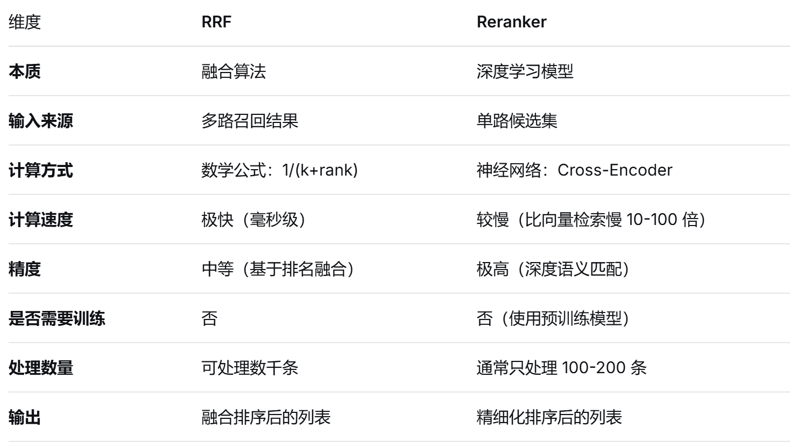

alias:: Rerank
tags::
type:: 概念
status:: 草稿 | 整理中 | 已掌握
id:: 69c23c0b-5118-4c19-a957-a4efd95480ae

	- ## 🧠 一句话说清楚（费曼）
		- **重排序**是对召回的Chunk进行排序，从而实现将高相关性信息筛选出来优先提供给模型，达到提高生成质量的目的
		- DOING 一个含有重排序的完整检索流程，一个完整重排序流程包含[[RRF]]和 [[Reranker]]
		  :LOGBOOK:
		  CLOCK: [2026-03-24 Tue 15:50:03]--[2026-03-24 Tue 15:50:27] =>  00:00:24
		  CLOCK: [2026-03-24 Tue 15:50:28]--[2026-03-24 Tue 15:50:28] =>  00:00:00
		  CLOCK: [2026-03-24 Tue 15:50:34]
		  :END:
			- ```text
			  用户查询
			     ↓
			  ┌─────────────────────────────────────┐
			  │           多路召回（粗排）            │
			  ├─────────────────┬───────────────────┤
			  │   向量检索       │     BM25 检索       │
			  │  (返回100条)     │   (返回100条)       │
			  └─────────────────┴───────────────────┘
			     ↓
			           RRF 融合
			     （合并去重，按倒数排名分数重排）
			     ↓
			          前 N 条候选
			     （如 50 条）
			     ↓
			       精排 Reranker
			     （bge-reranker-v2-m3）
			     ↓
			         最终 top_k
			     （如 5 条）
			     ↓
			           LLM 生成
			  ```
		- [[RRF]]和 [[Reranker]]的异同
			- 
	- ## 💘企业开发场景
	- ## 📝 面试题（自问自答）
	  collapsed:: true
		- RAG 中为什么要加 Rerank（重排序）？作用是什么？一般用什么模型？#card #面试背诵汇总/大模型/RAG/重排序
		  collapsed:: true
			- 提高大模型最终的回答质量。RAG混合检索经过结果融合后依旧有大量的chunk（甚至几百条），我们需要从中选出相关性最高的5～10条送给大模型能有效提高大模型最终的回答质量。
			- Rerank 是对召回结果和用户问题进行**相关性打分**
			- 项目冷启动阶段可以使用大模型；当请求量上来后为了将本提速，就要更换为专用轻量 Rerank 模型，进行重排。
			-