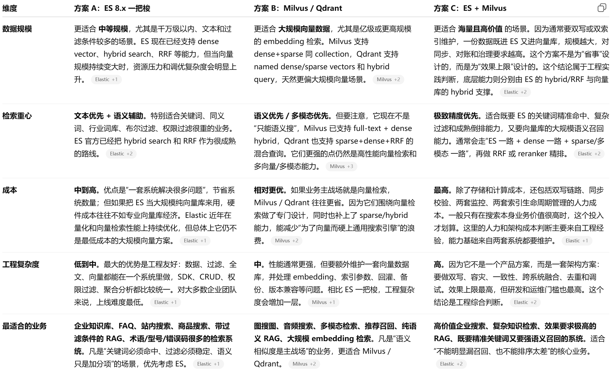

- 企业实际开发当中如何构建向量库的？ #card #面试背诵汇总/重点
  collapsed:: true
	- {:height 465, :width 749}
	-
- chunk去重 #card #面试背诵汇总/重点
  collapsed:: true
	- 按 **数据 ID** 去重
		- 一般发生在 **粗排时** 或 **粗排之后**
		- 作用：去掉多路召回后重复返回的同一条数据
	- 业务去重
		- 按 **业务语义** 去重，不只是看 ID
		- 一般发生在 **精排之后**
	- 典型场景：
		- **相似问 FAQ**
		- 多条内容意思接近、但表达不同
	- 作用：
		- 防止结果列表被相似内容 **霸屏**
		- 防止用户总看到同类信息，形成 **信息茧房**
- 如何保证LLM输出格式为Json？ #面试背诵汇总/重点 #card
  collapsed:: true
	- 事前引导
		- 事前引导就是少量样本提示，也就是在提示词里面写上几个示例
		- 代码示例
		  collapsed:: true
			- ```python
			  prompt = """
			  你是一个信息抽取助手。
			  请从下面文本中提取姓名、年龄、职业，并严格输出 JSON。
			  
			  示例：
			  输入：张三，28岁，是一名程序员。
			  输出：
			  {
			    "name": "张三",
			    "age": 28,
			    "job": "程序员"
			  }
			  
			  现在请处理下面这段文本：
			  李四今年32岁，在医院工作，是一名医生。
			  """
			  ```
	- 事中约束
		- 事中约束呢就是嗯使用structure outputs这种结构化输出进行约束
		- 代码示例
		  collapsed:: true
			- ```python
			  from pydantic import BaseModel, Field
			  from langchain.output_parsers import PydanticOutputParser
			  from langchain_core.prompts import ChatPromptTemplate
			  
			  class UserInfo(BaseModel):
			      name: str = Field(description="用户的姓名")
			      city: str = Field(description="用户居住的城市")
			      age: int = Field(description="用户的年龄")
			  
			  pydantic_parser = PydanticOutputParser(pydantic_object=UserInfo)
			  
			  prompt = ChatPromptTemplate.from_template(
			      """从以下文本中提取用户的姓名、城市和年龄。
			  
			  {format_instructions}
			  
			  文本: {text}"""
			  )
			  
			  chain = prompt | llm | pydantic_parser
			  
			  result = chain.invoke({
			      "format_instructions": pydantic_parser.get_format_instructions(),
			      "text": "张伟是一位居住在北京的软件工程师，他今年30岁。"
			  })
			  
			  print(result)
			  ```
	- 事后校验
		- 事后校验就是在调用接口之前进行参数校验。如果参数校验不合格，就让他重新提取结构化数据
		- 代码示例
		  collapsed:: true
			- ```python
			  import json
			  
			  def extract_with_retry(llm, text, max_retry=3):
			      prompt = f"""
			  请从下面文本中提取 name、age、job。
			  只输出 JSON，不要输出任何解释。
			  文本：{text}
			  """
			  
			      for i in range(max_retry):
			          result = llm.generate(prompt)  # 假设这里返回字符串
			  
			          try:
			              data = json.loads(result)
			              if validate_json(data):
			                  return data
			          except Exception:
			              pass
			  
			          prompt = f"""
			  上一次输出不符合要求。
			  请重新输出合法 JSON，字段必须包含 name、age、job。
			  只输出 JSON，不要解释。
			  文本：{text}
			  """
			  
			      raise ValueError("多次重试后仍未得到合法 JSON")
			  ```
	- 低温度温度参数(0.0)
		- 调低温度参数指令，这样能够很大程度上的解决这种问题
		- 代码示例
		  collapsed:: true
			- ```python
			  response = llm.generate(
			      prompt="请提取：孙七今年24岁，是一名设计师。只输出 JSON。",
			      temperature=0.0
			  )
			  ```
- [[文档清洗]]
- [[文档切分]]
- 自定义评估和ragas评估之间该如何选择？
	- 自定义评估
	  collapsed:: true
		- 有标准答案
		  collapsed:: true
			- 比如：必须包含哪个ID、必须包含哪些关键词、不能出现哪些内容
		- 有明确业务规则
		  collapsed:: true
			- 什么算对、什么算错，比如：必须命中 `expected_ids`、必须包含 `must_include`、不能包含 `must_not_include`、该拒答时必须拒答、分类必须是 `expected_category`
	- ragas评估
	  collapsed:: true
		- **没有明确标准答案**，或者答案高度开放，不容易用规则完全判定
		- **想看模型生成质量的趋势**，比如回答是否相关、是否忠实于上下文、文本流畅度如何。
		- **评价语义相似度**、长文本生成一致性或者生成回答与上下文匹配情况。
	- 评估维度
		- 自定义评估
			- 路由命中
			- 检索召回
			- 首条命中
			- key_points 覆盖
			- 答案相似度
			- 拒答正确性
		- ragas评估
			- context_recall（召回率，召回chunk中关键信息有没有漏掉）
			- context_precision（准确率，召回chunk中真正有用的占多少）
			- answer_relevancy（回答，有没有答偏、答空、答得很冗余）
			- faithfulness（有没有根据上下文胡编）
	- 总之：规则无法完全覆盖的开放型或质量趋势评估，用 Ragas；规则可判定的就用自定义评估。
	- 自定义评估(主评估)和Ragas(辅评估) = **工程验收 + 模型体感**的双轨方案。
- RA g评估的标准是什么？什么样才算是一个好的RAG？他是有哪几种方式去评估，比如说ragAS或者是自己去写那个评估的一个自动化评估脚本
- 常见的企业rAG都有哪几类？那么针对这几类是不是可以进行针对化的一个复习？